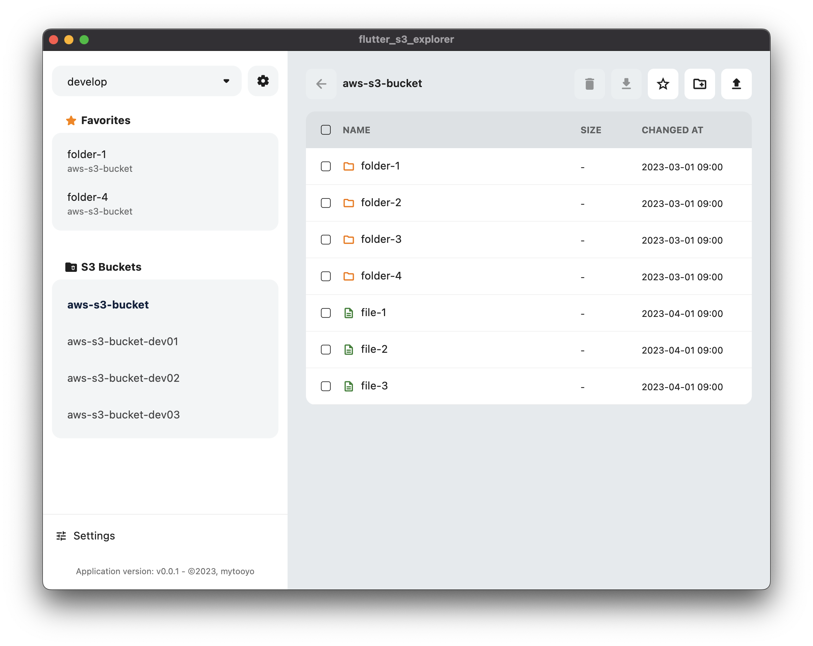

# Flutter S3 Explorer


This is a tool for working with S3 on AWS.  
It allows you to upload local files and download files/folders from S3.

UI and profile management implemented in Flutter, AWS API implemented in Rust.  
[flutter_rust_bridge](https://github.com/fzyzcjy/flutter_rust_bridge) is used as a bridge between Flutter and Rust.  

Please refer to the [official document](https://cjycode.com/flutter_rust_bridge/) for how to install and use [flutter_rust_bridge](https://github.com/fzyzcjy/flutter_rust_bridge).  

## Screenshot


## User Guide

1. [Install Flutter](https://docs.flutter.dev/get-started/install)
1. [Install Rust](https://www.rust-lang.org/tools/install)
1. [Install flutter_rust_bridge](https://cjycode.com/flutter_rust_bridge/quickstart.html)


### When running for MacOS
```shell
flutter pub get
flutter run -d macos
```

### Platforms confirmed to work

|Platform|Confirmed|
|---|---|
|macOS|⭕️|
|iOS(iPadOS)|⭕️|
|Android|❌|
|Windows|❌|
|Linux|❌|


### Rust Code Generate
If you have rewritten Rust code, you will need a code generator to generate a Rust and Flutter bridge file.  
See help for how to use. (`flutter_rust_bridge_codegen -h`)

```
flutter_rust_bridge_codegen \
  -r native/src/api.rs \
  -c ios/Runner/bridge_generated.h \
  -e macos/Runner/ \
  --dart-output lib/bridge/bridge_generated.dart \
  --dart-decl-output lib/bridge/bridge_definitions.dart
```


## LISENCE
MIT License
